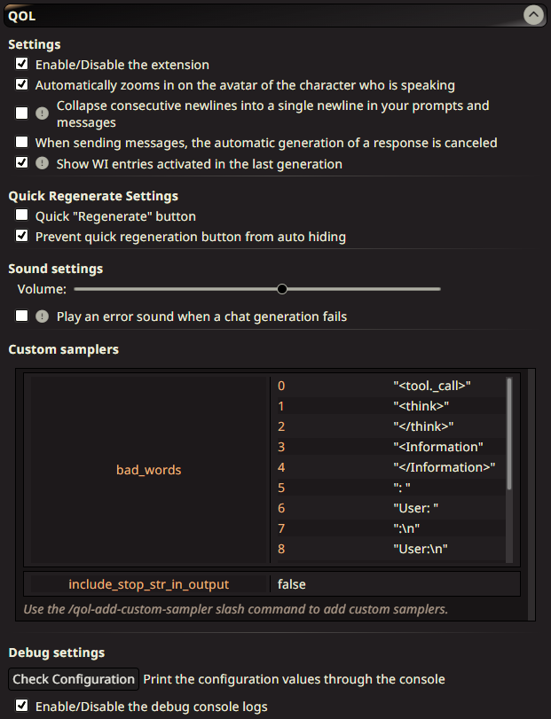

# SillyTavern-QOL

The idea of ​​this extension is to add small changes to facilitate the experience of using SillyTavern, either from quick access buttons in convenient areas, displaying useful information that is usually hidden/hard to access; etc.
- SillyTavern `+=1.15.0` required

## Features

For now, the added features are the following:
- A quick access button to retry the last message. It adds a regenerate button right next to the send button, the same regenerate button that can be found in the burger menu of the input area.
- When generating a message returns an error, a sound will be played to inform you in case you have ST in the background.
- Allow the talking character's avatar to always have zoom applied, automatically changing the avatar when another character or the user speaks.
> It has a section in the settings menu to change the position in the UI and change the detection mode. In Guess mode, it will zoom the avatar of the latest detected chat member name on the last message (it detects names from detached Status blocks from [Stat-Us Maximus](https://github.com/leandrojofre/SillyTavern-Stat-us-Maximus)).
- Automatically cancel the generation of a message after a user input. For people, like me, who always edit or hit continue message to their own message and are tired of clicking cancel themselves.
- Show lorebook entries activated in the last generation in the left side panel.
- The `API` settings for `AI Horde` is given a button of top of the model selector to see a list with all available providers.
- There is a setting to collapse all consecutive newlines that works on Chat Completions.
- Allow to set custom parameters for your text generation requests via slash commands.
  - `/qol-add-custom-sampler key="{sampler-key}" {value}`
  - `/qol-get-custom-sampler key="{sampler-key}"`
  - `/qol-del-custom-sampler key="{sampler-key}"`
  - `/qol-flush-custom-samplers`
- Allow to set the tag filters for character lists from commands.
  - `/qol-set-tag-filter filter="{filter-id}" {tag-name|tag-id}`
  - `/qol-flush-tag-filter filter="{filter-id}"`
- Macros added:
  - `{{charLastZoomed}}` to fetch the name of the latest zoomed character.

If you have any suggestions, do not hesitate to leave them. If you want to contribute, do not hesitate to fork the repository.

## Installation

Paste this link into the `Install extension` button from the `Extensions` panel:

```https://github.com/leandrojofre/SillyTavern-QOL.git```

## Usage

From the extension configuration menu, you can enable/disable each feature of the extension.



## Support and Contributions

- @city-unit - Creator of the [template](https://github.com/city-unit/st-extension-example) used by this repo.
